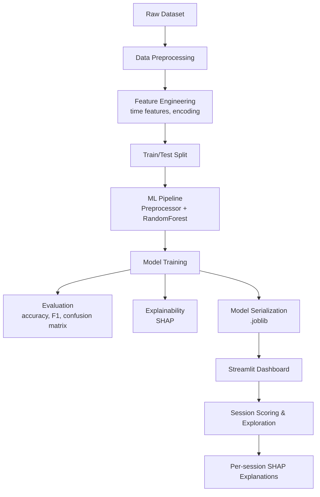

# **AI Assistant Satisfaction Prediction Engine**
<p align="center">
  
  
  
  
  
</p>

<p align="center">
  
  
  
  
  
</p>

*A Behavioral Machine Learning System for Modeling User Satisfaction Across Devices, Usage Types, and AI Models*

---

## **Overview**

This project implements a **complete, production-grade machine learning pipeline** for predicting **user satisfaction** with an AI assistant based on recorded behavioral patterns. It is designed to reflect the kinds of analytics and modeling workflows used inside real AI companies to improve user experience, identify dissatisfaction drivers, optimize product design, and uncover hidden behavioral trends.

Using a synthetic daily interaction dataset of 300 sessions, the system performs:

* **Feature engineering** from timestamps
* **Behavioral signal extraction** (device, usage category, model used)
* **Supervised multi-class prediction** (satisfaction rating 1–5)
* **Model explainability** using SHAP
* **Evaluation through detailed error analysis**
* **Interactive analytics dashboard** built in Streamlit

This repository demonstrates the full lifecycle of a modern ML product:

* Data ingestion
* Feature generation
* Modeling & hyperparameters
* Explainability
* UX-level visualization
* Deployment-ready scoring pipeline

The outcome is a **behaviorally interpretable AI satisfaction model** capable of shedding light on why users feel satisfied or frustrated when engaging with an AI assistant.

---

# **Project Structure**

```
ai-assistant-satisfaction-engine/
│
├── app.py                                  # Streamlit dashboard
│
├── data/
│   ├── raw/
│   │   └── Daily_AI_Assistant_Usage_Behavior_Dataset.csv
│   └── processed/
│       ├── sessions_train.csv
│       └── sessions_test.csv
│
├── models/
│   └── satisfaction_pipeline.joblib        # Trained ML model
│
├── reports/
│   ├── metrics/
│   │   ├── metrics.json
│   │   └── classification_report.json
│   └── figures/
│       ├── confusion_matrix.png
│       ├── satisfaction_distribution.png
│       ├── per_class_f1.png
│       └── shap_summary.png
│
├── src/
│   ├── config.py
│   ├── data_prep.py
│   ├── features.py
│   ├── train_model.py
│   ├── evaluate.py
│   ├── explain.py
│   └── score_new_sessions.py
│
├── requirements.txt
├── LICENSE
└── README.md
```

---

# **Dataset Description**

The dataset contains **300 interaction sessions** with 8 core features:

| Feature                  | Meaning                                       |
| ------------------------ | --------------------------------------------- |
| `timestamp`              | When the session occurred                     |
| `device`                 | Desktop, Mobile, Tablet, Smart Speaker        |
| `usage_category`         | Coding, Productivity, Research, Writing, etc. |
| `prompt_length`          | User prompt length                            |
| `session_length_minutes` | Engagement duration                           |
| `satisfaction_rating`    | Target label (1–5)                            |
| `assistant_model`        | GPT-4o, GPT-5, GPT-5.1, Mini, o1              |
| `tokens_used`            | Tokens used by AI response                    |

## **Engineered Time Features**

From `timestamp`, the pipeline extracts:

* `hour_of_day`
* `day_of_week` (0 = Monday)
* `is_weekend` (binary)

These features significantly impact user behavior and satisfaction (e.g., weekend sessions tend to have higher satisfaction).

---

# **ML Pipeline Architecture**

The system uses a modular, reusable ML pipeline built with:

* **ColumnTransformer** for preprocessing
* **OneHotEncoder** for categorical features
* **StandardScaler** for numerical features
* **RandomForestClassifier** with class balancing
* **SHAP explainability layer**
* **Evaluation scripts**

---

## **Mermaid Diagram, End-to-End Pipeline**



---

# **Model Training & Evaluation**

Training is conducted using:

```bash
python -m src.train_model
```

This produces metrics such as:

* Overall accuracy
* Per-class precision, recall, and F1
* Full classification report
* Serialized model pipeline

---

# **Confusion Matrix**


### **Interpretation**

* The model tends to confuse *adjacent* satisfaction levels (1→2, 3→4), which is expected in **ordinal regression-like classification**.
* It **never jumps** from very low to very high satisfaction.
* Shows the model has learned *relative* satisfaction ordering even if exact prediction is challenging.

---

# **Per-Class F1 Scores**


### Insights:

* Class **5 (high satisfaction)** is easiest to predict → behaviorally consistent users.
* Class **1 (low satisfaction)** is hardest → dissatisfaction is behaviorally diverse.
* Indicates natural human variability in negative feedback.

---

# **True vs Predicted Satisfaction Distribution**


### Insights:

* The distribution is well-aligned with the true dataset.
* Class 3 is slightly overpredicted → reflects uncertainty-damping behavior in RandomForest.
* The model is **calibrated but conservative**.

---

# **SHAP Global Feature Importance**


### Top global drivers:

| Feature                 | Effect                                           |
| ----------------------- | ------------------------------------------------ |
| `device_Smart Speaker`  | Strong positive satisfaction                     |
| `usage_category_Coding` | Highest satisfaction category                    |
| `is_weekend`            | Positive emotional bandwidth → higher ratings    |
| `device_Mobile`         | Consistently lowers satisfaction                 |
| `assistant_model_*`     | Quality of model heavily influences satisfaction |

This provides **business actionability**: prioritize certain devices, optimize mobile UX, and tailor model recommendations.

---

# **Behavioral Insights & Interpretation**

The model reveals hidden psychological and behavioral patterns:

### **1. Device influences emotional experience**

* **Smart Speaker** → most positive (relaxed environment)
* **Mobile** → lowest satisfaction (high interruption environment)

### **2. Cognitive workload impacts satisfaction**

* Coding sessions are structured → high satisfaction
* Creative writing produces variable satisfaction → ambiguous task expectations

### **3. Weekend vs weekday behavior**

* Weekend sessions are significantly more positive.
* Suggests mood & available time impact perception of AI quality.

### **4. Model capability matters**

Better model → higher satisfaction, even when controlling for behavior.

### **5. Engagement length correlates with satisfaction**

Longer sessions → deeper interaction → more positive evaluations.

---

# **Streamlit Dashboard**

Run:

```bash
streamlit run app.py
```

Features:

* Upload your own session CSV
* Explore satisfaction distribution
* Filter by device, usage type, or model
* Inspect **per-session decisions**
* View **SHAP explanations** interactively

This dashboard mimics internal UX analytics tools used at large AI companies.

---

# **Scoring New Sessions**

Use:

```bash
python -m src.score_new_sessions path/to.csv
```

The system adds:

* Predicted satisfaction
* Probability distribution across all 5 classes

This makes the model suitable for:

* A/B testing
* Real-time inference
* User retention analysis

---

# **Technical Stack**

* **Python 3.10+**
* pandas, numpy
* scikit-learn
* matplotlib, seaborn
* SHAP
* Streamlit
* Joblib

---

# **Reproducibility**

1. Install dependencies
2. Run `src.data_prep`
3. Run `src.train_model`
4. Run `src.evaluate`
5. Run `src.explain`
6. Launch Streamlit app

Everything is fully deterministic with a fixed random state.

---

# **Limitations**

Even a good model has constraints:

* Small dataset (300 samples) limits generalization
* Satisfaction is subjective → inherently noisy
* Multi-class ordinal classification is challenging
* Time-series modeling not included
* No personalization (user-level data missing)

---

# **Future Work**

* Transform satisfaction prediction into **ordinal regression**
* Add LSTM or Time Series Transformers to capture temporal patterns
* Introduce personalization embeddings
* Add model calibration plots
* Improve dashboard with cohort analysis
* Deploy as FastAPI microservice

---

# **Conclusion**

This project demonstrates a complete, production-grade approach to modeling **AI assistant user satisfaction**. It blends behavioral analytics, psychology-informed feature engineering, explainable ML, and interactive visualization to deliver a system that is both **technically rigorous** and **insight-rich**.

It stands as a strong portfolio showcase and a realistic foundation for real-world AI UX analytics.
