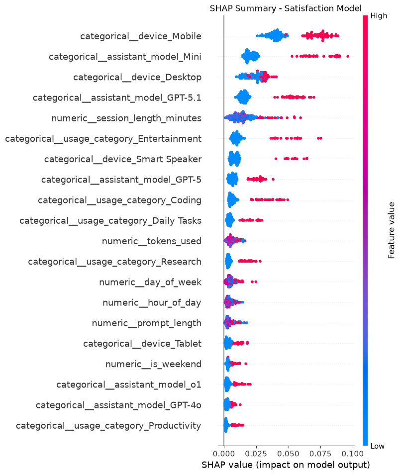
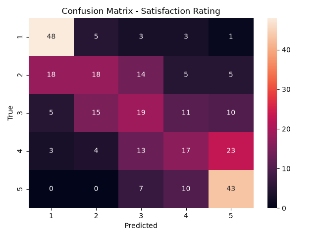
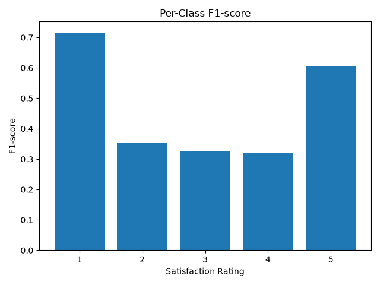
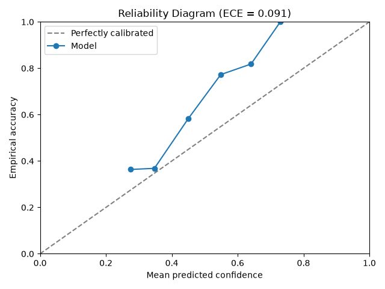
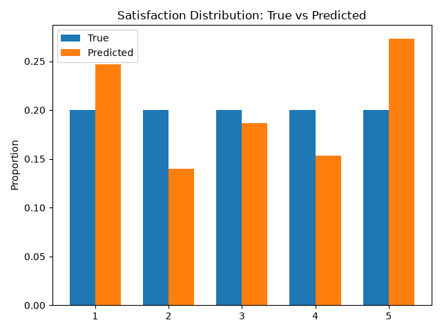

<div align="center">

# AI Assistant Satisfaction Prediction Engine


[](https://github.com/AmirhosseinHonardoust/AI-Assistant-Satisfaction-Prediction-Engine/actions/workflows/ci.yml)

</div>

A behavioral machine-learning workflow for turning AI-assistant session logs into **satisfaction predictions**, **ordinal-aware evaluation**, **calibrated probabilities**, **SHAP-based explanations**, and an **interactive analytics dashboard**.

> **Important:** This project is a **portfolio and research demo**, not a production analytics or user-measurement system.
>
> The dataset is **synthetic and generated by a documented process**, so the model, metrics, and "behavioral insights" exist to demonstrate a clean, honest ML workflow. They recover a signal that was designed into the data and should not be read as real findings about how people feel about AI assistants.

---

## Table of Contents

- [Project Overview](#project-overview)
- [What This Project Does](#what-this-project-does)
- [What This Project Does Not Do](#what-this-project-does-not-do)
- [Key Features](#key-features)
- [System Workflow](#system-workflow)
- [Project Structure](#project-structure)
- [Installation](#installation)
- [Quick Start](#quick-start)
- [Training and Evaluation](#training-and-evaluation)
- [Ordinal vs Flat Comparison](#ordinal-vs-flat-comparison)
- [Calibration and Reliability](#calibration-and-reliability)
- [Scoring New Sessions](#scoring-new-sessions)
- [Streamlit Dashboard](#streamlit-dashboard)
- [Evaluation Metrics](#evaluation-metrics)
- [Visual Reports](#visual-reports)
- [Testing and CI](#testing-and-ci)
- [Code Quality](#code-quality)
- [Limitations](#limitations)
- [Responsible Use](#responsible-use)
- [Future Improvements](#future-improvements)
- [Tech Stack](#tech-stack)
- [Author](#author)
- [License](#license)

---

## Project Overview

Predicting user satisfaction is not only a classification problem. To be useful, a model score has to support a defensible interpretation:

- predict a 1-5 satisfaction rating from session behavior
- measure how *close* predictions are, not just whether they are exact
- report calibrated confidence, not raw scores
- explain which behavioral features drive each decision
- state clearly what the data can and cannot support

This project demonstrates that end-to-end workflow on a synthetic daily-usage dataset. It generates data from a documented latent process, engineers time features, trains a scikit-learn pipeline, evaluates it with ordinal-aware and calibration metrics, explains it with SHAP, and exposes everything through a Streamlit dashboard.

The goal is to show how a satisfaction model becomes an **interpretable decision-support workflow** whose modest results are honest and reproducible, rather than a single inflated accuracy number.

---

## What This Project Does

This project can:

- Generate a synthetic daily-usage dataset from a documented latent process
- Engineer time features (`hour_of_day`, `day_of_week`, `is_weekend`) from timestamps
- Train a calibrated multi-class satisfaction model using a scikit-learn pipeline
- Evaluate accuracy, cross-validated accuracy, MAE, quadratic-weighted kappa, log loss, and ECE
- Compare the model against a majority-class baseline
- Compare flat multi-class against a Frank & Hall ordinal model reproducibly
- Produce a reliability diagram and calibration diagnostics
- Explain global drivers and per-session predictions with SHAP
- Score new session CSVs with predicted rating and per-class probabilities
- Provide a Streamlit dashboard for exploration and per-session explanations
- Run automated tests and a GitHub Actions quality gate plus pipeline smoke workflow

---

## What This Project Does Not Do

This project does **not**:

- Measure real users' satisfaction with any real AI assistant
- Provide product, UX, or business recommendations
- Use a production or real-world dataset
- Guarantee that the designed effects match human behavior
- Provide real-time inference infrastructure
- Include monitoring, drift detection, or retraining automation
- Certify the model for any high-stakes or customer-facing decision

A real analytics system would need genuine user data, privacy and consent controls, monitoring, experiment design, and domain review.

---

## Key Features

- **Documented synthetic generator** so the "ground truth" behavioral signal is explicit and reproducible
- **Multi-class satisfaction model** (RandomForest inside a preprocessing pipeline)
- **Ordinal-aware evaluation** with mean absolute error and quadratic-weighted kappa
- **Honest baselining** against a majority-class classifier
- **Cross-validated accuracy** reported next to the single-split number
- **Frank & Hall ordinal comparison** kept as a reproducible experiment, not an assertion
- **Calibration diagnostics** with a reliability diagram and Expected Calibration Error
- **SHAP explainability** for both global drivers and per-session contributions
- **Version-robust SHAP handling** across the list and ndarray output conventions
- **Streamlit dashboard** for distribution, segmentation, and per-session explanations
- **Unit tests and GitHub Actions CI** with a full-pipeline job that publishes artifacts
- **Model as a build artifact** (trained by CI and locally, not committed to git)

---

## System Workflow

```text
Synthetic generator (documented DGP)
        ↓
Raw dataset
        ↓
Time-feature engineering + stratified train/test split
        ↓
Preprocessing + RandomForest pipeline
        ↓
Metrics: accuracy, CV, MAE, QWK, log loss, ECE, baseline
        ↓
Evaluation: confusion matrix, per-class F1, reliability, ordinal comparison
        ↓
Explainability: global + per-session SHAP
        ↓
Model serialization (build artifact)
        ↓
Streamlit dashboard and batch scoring
```

---

## Project Structure

```text
AI-Assistant-Satisfaction-Prediction-Engine/
│
├── .github/
│   └── workflows/
│       └── ci.yml
│
├── app.py
│
├── data/
│   ├── raw/
│   │   └── Daily_AI_Assistant_Usage_Behavior_Dataset.csv
│   └── processed/
│       ├── sessions_train.csv
│       └── sessions_test.csv
│
├── models/
│   └── .gitkeep                             # satisfaction_pipeline.joblib is a
│                                            #   build artifact (git-ignored)
│
├── reports/
│   ├── metrics/
│   │   ├── metrics.json
│   │   ├── classification_report.json
│   │   └── ordinal_comparison.json
│   └── figures/
│       ├── confusion_matrix.png
│       ├── satisfaction_distribution.png
│       ├── per_class_f1.png
│       ├── reliability_diagram.png
│       └── shap_summary.png
│
├── src/
│   ├── __init__.py
│   ├── config.py
│   ├── generate_data.py
│   ├── time_features.py
│   ├── data_prep.py
│   ├── features.py
│   ├── shap_utils.py
│   ├── model_metrics.py
│   ├── ordinal.py
│   ├── train_model.py
│   ├── evaluate.py
│   ├── explain.py
│   └── score_new_sessions.py
│
├── tests/
│   ├── __init__.py
│   ├── test_generate_data.py
│   ├── test_heavy_optional.py
│   ├── test_metrics.py
│   ├── test_ordinal.py
│   ├── test_pipeline.py
│   ├── test_shap_utils.py
│   └── test_time_features.py
│
├── .gitignore
├── pyproject.toml
├── requirements.txt
├── LICENSE
└── README.md
```

---

## Installation

### 1. Clone the Repository

```bash
git clone https://github.com/AmirhosseinHonardoust/AI-Assistant-Satisfaction-Prediction-Engine.git
cd AI-Assistant-Satisfaction-Prediction-Engine
```

### 2. Create a Virtual Environment

On Windows CMD:

```cmd
python -m venv .venv
.venv\Scripts\activate
```

On macOS/Linux:

```bash
python -m venv .venv
source .venv/bin/activate
```

### 3. Install Requirements

```bash
pip install -r requirements.txt
```

---

## Quick Start

The whole workflow runs with zero external data — the raw dataset is generated
from a documented process:

```bash
python -m src.generate_data     # create the synthetic raw dataset
python -m src.data_prep         # time features + stratified train/test split
python -m src.train_model       # train, evaluate, write model + metrics
```

Generate figures and explanations, then launch the dashboard:

```bash
python -m src.evaluate          # confusion matrix, per-class F1, reliability, ordinal comparison
python -m src.explain           # global SHAP summary
streamlit run app.py
```

Everything is deterministic given the fixed `RANDOM_STATE` (42).

---

## Training and Evaluation

The training step fits the pipeline, evaluates it against a baseline, and writes
metrics and the serialized model.

```bash
python -m src.train_model
```

Generated evaluation outputs include:

```text
models/satisfaction_pipeline.joblib
reports/metrics/metrics.json
reports/metrics/classification_report.json
reports/metrics/ordinal_comparison.json
reports/figures/confusion_matrix.png
reports/figures/per_class_f1.png
reports/figures/satisfaction_distribution.png
reports/figures/reliability_diagram.png
reports/figures/shap_summary.png
```

`models/satisfaction_pipeline.joblib` is a **build artifact** and is not
committed to git (it is `.gitignore`d). Because the pipeline is deterministic,
you reproduce it exactly with `python -m src.train_model`. CI also trains it on
every run and publishes it, along with `reports/`, as a downloadable GitHub
Actions artifact.

---

## Ordinal vs Flat Comparison

The 1-5 target is ordered, so a natural question is whether a dedicated **ordinal**
model beats flat multi-class. This is tested reproducibly in
`src/evaluate.py` (`compare_ordinal_vs_flat`), which fits a Frank & Hall ordinal
wrapper (`src/ordinal.py`) on the same split and writes
`reports/metrics/ordinal_comparison.json`.

<div align="center">

| Model | Accuracy | MAE | QWK |
|---|---|---|---|
| Flat RandomForest (default) | **0.483** | **0.713** | **0.726** |
| Frank & Hall ordinal RF | 0.397 | 1.007 | 0.640 |

</div>

The flat forest wins on every metric — it already respects the ordering, and its
quadratic-weighted kappa of **0.726** shows most errors are adjacent ratings — so
it stays the default. The ordinal model is kept as a documented, tested
alternative rather than dropped, so the conclusion is checkable, not asserted.

> This is an experiment, not a claim: swap in the ordinal model if your data behaves differently.

---

## Calibration and Reliability

`predict_proba` reliability is measured with a reliability diagram and Expected
Calibration Error (ECE), which compares predicted confidence against observed
accuracy.

The RandomForest is moderately calibrated (**ECE ≈ 0.091**). Post-hoc sigmoid
(Platt) recalibration reduces ECE to about 0.06 but costs roughly 3 points of
accuracy, so it is reported rather than applied by default. Enable it downstream
with `sklearn.calibration.CalibratedClassifierCV` if trustworthy probabilities
matter more than exact-rating accuracy for your use case.

> Calibration diagnostics describe probability quality; they are not a guarantee of correctness.

---

## Scoring New Sessions

Score a CSV of new sessions with predicted rating and per-class probabilities:

```bash
python -m src.score_new_sessions path/to/sessions.csv
```

The output adds a `pred_satisfaction` column and a probability column per class
(`p_rating_1` ... `p_rating_5`), suitable for downstream analysis.

---

## Streamlit Dashboard

Launch the app:

```bash
streamlit run app.py
```

The dashboard includes:

- upload of a session CSV or use of the sample test set
- overview metrics for total sessions and average satisfaction
- true vs predicted satisfaction distribution
- segmentation by device, usage category, or model
- per-session predictions with **SHAP explanations** (correctly mapped, one value per feature)

The dashboard helps review overall model behavior, segment-level patterns, and
individual decisions.

---

## Evaluation Metrics

The evaluation layer reports metrics designed for an ordered, noisy target.

<div align="center">

| Metric | Why it matters |
|---|---|
| Accuracy | Exact-rating hit rate at the default decision rule |
| 5-fold CV accuracy | Stability across folds, so the split is not cherry-picked |
| Majority baseline | Chance reference for a balanced 5-class target |
| Quadratic-weighted kappa | Agreement that rewards near predictions (ordinal quality) |
| Mean absolute error | Average rating distance — most misses are off-by-one |
| Log loss | Probability quality across all classes |
| ECE | Calibration gap between predicted confidence and accuracy |

</div>

Example results from the included run:

<div align="center">

| Metric | Example value |
|---|---|
| Accuracy | 0.483 |
| 5-fold CV accuracy | 0.429 ± 0.036 |
| Majority baseline | 0.200 |
| Lift over baseline | +0.283 |
| Quadratic-weighted kappa | 0.726 |
| Mean absolute error | 0.713 |
| Log loss | 1.251 |
| Expected calibration error | 0.091 |

</div>

> These values come from a synthetic dataset and demonstrate the workflow; they are not real-world satisfaction measurements.

---

## Visual Reports

### Model explainability and errors

<div align="center">

| SHAP Global Importance | Confusion Matrix |
|---|---|
|  |  |
| **Analysis:** Global SHAP importance recovers the effect sizes designed into the generator — device, assistant model, usage category, and session length — confirming the model learns the intended signal rather than noise. | **Analysis:** The confusion matrix shows errors concentrate on adjacent ratings; extreme ratings (1 and 5) are separated most cleanly, as expected for an ordinal-like task. |

</div>

### Prediction behavior and calibration

<div align="center">

| Per-Class F1 | Reliability Diagram |
|---|---|
|  |  |
| **Analysis:** Class 1 and class 5 achieve the highest F1 because their latent scores are least ambiguous; the middle classes overlap and are hardest to separate. | **Analysis:** The reliability diagram compares predicted confidence against empirical accuracy. The model is moderately calibrated (ECE ≈ 0.091), with recalibration available as a documented trade-off. |

</div>

<details>
<summary>Additional distribution chart</summary>

<div align="center">



The true vs predicted distribution shows the model tracks the real class balance with mild regression toward the middle classes — typical conservative behavior for a RandomForest under noise.

</div>

</details>

---

## Testing and CI

Run unit tests locally:

```bash
python -m pytest
```

Run the quality gate locally (matches CI):

```bash
ruff check .          # lint (E, F, I, B, SIM, UP), line-length 100
black --check .       # formatting, line-length 100
mypy src app.py       # static type checking
pytest                # 20 unit tests (heavy shap/streamlit tests skip cleanly)
```

The GitHub Actions workflow runs two jobs:

- **quality-gate** — ruff, black, mypy, and pytest on Python 3.10 and 3.12
- **pipeline** — runs `generate_data → data_prep → train_model → evaluate → explain` end-to-end and uploads the trained model and reports as artifacts

This exercises the full training path in CI, not just the unit tests. CI is
defined in:

```text
.github/workflows/ci.yml
```

The 20 tests cover time-feature engineering, the training pipeline, the
stratified split, batch scoring round-trips, the documented data signal, the
version-robust SHAP shape helpers, the Frank & Hall ordinal classifier, and the
ordinal/calibration metric helpers (ECE, MAE, QWK).

---

## Code Quality

The project separates responsibilities across small, focused modules:

<div align="center">

| Module | Purpose |
|---|---|
| `src/config.py` | Central paths, feature lists, and constants |
| `src/generate_data.py` | Documented synthetic data generator |
| `src/time_features.py` | Shared time-feature engineering |
| `src/data_prep.py` | Loads data, engineers features, stratified split |
| `src/features.py` | Builds the preprocessing + RandomForest pipeline |
| `src/train_model.py` | Trains, evaluates, and writes metrics and the model |
| `src/evaluate.py` | Figures, reliability diagram, ordinal comparison |
| `src/explain.py` | Global SHAP summary |
| `src/shap_utils.py` | Version-robust SHAP shape helpers |
| `src/model_metrics.py` | Ordinal and calibration metric helpers |
| `src/ordinal.py` | Frank & Hall ordinal classifier |
| `src/score_new_sessions.py` | Batch scoring CLI |

</div>

---

## Limitations

This project has important limitations:

- The dataset is synthetic, not real user data
- Results reflect a *designed* signal, not real human behavior
- Metrics do not prove real-world satisfaction-prediction performance
- Moderate accuracy (~0.48, CV ~0.43) is intentional to keep the task realistic
- A Frank & Hall ordinal model was evaluated and did not beat the flat forest here
- No per-user personalization or temporal modeling is included
- The dashboard is a demo, not a secure analytics platform

The project is strongest as a portfolio demonstration of an honest, reproducible
ML workflow with explainability and calibrated evaluation.

---

## Responsible Use

This repository is intended for:

- learning about pipelines, explainability, and calibrated evaluation
- demonstrating an honest, reproducible ML workflow
- practicing ordinal-aware and calibration metrics
- portfolio demonstration

It should not be used as-is for:

- measuring or reporting real users' satisfaction
- product, UX, or business decisions
- any customer-facing or high-stakes decision

Any real deployment would require genuine user data, privacy and consent
controls, experiment design, monitoring, and domain review.

---

## Future Improvements

Potential next improvements:

- Validate on a real (non-synthetic) dataset — the single biggest open item
- Add per-user personalization and temporal / sequence features
- Add confidence intervals for reported metrics
- Add a FastAPI scoring endpoint served from the CI-built model artifact
- Add Docker support
- Add a policy-threshold or segment selector in the dashboard
- Add a model-card style summary report

---

## Tech Stack

- Python
- pandas
- NumPy
- scikit-learn
- matplotlib
- seaborn
- SHAP
- Streamlit
- joblib
- pytest
- GitHub Actions

---

## Author

**Amir Honardoust**

GitHub: [@AmirhosseinHonardoust](https://github.com/AmirhosseinHonardoust)

---

## License

This project is released under the MIT License and is intended for educational,
research, and portfolio purposes.

If you use or modify this project, please keep the responsible-use notes and
limitations clear.
