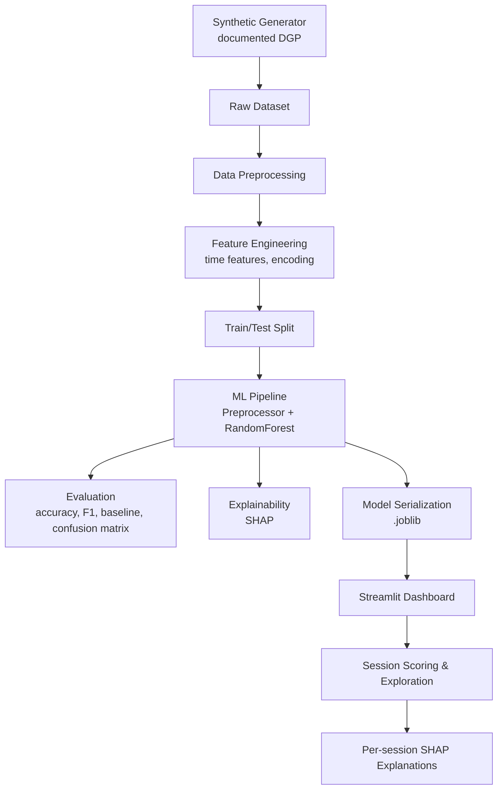

# **AI Assistant Satisfaction Prediction Engine**
<p align="center">
  
  
  
  
  
</p>
<p align="center">
  
  
  
  
  
</p>

*A behavioral machine learning system for modeling user satisfaction across devices, usage types, and AI models.*

---

## **Overview**

This project implements an end-to-end machine learning pipeline for predicting **user satisfaction** with an AI assistant from recorded session behavior. It mirrors the analytics workflows used to study user experience: ingest behavioral data, engineer features, train and evaluate a model, explain its decisions with SHAP, and expose everything through an interactive dashboard.

The dataset is **synthetic and generated by a documented process** (see [`src/generate_data.py`](src/generate_data.py)). Satisfaction is drawn from a known latent scoring function of device, usage category, model, session length and weekend effect, plus Gaussian noise. Because the data-generating process (DGP) is explicit, the "behavioral insights" below are **verifiable**: a good model should recover the effect sizes that were designed in — and it does.

The pipeline performs:

* **Feature engineering** from timestamps
* **Behavioral signal extraction** (device, usage category, model used)
* **Supervised multi-class prediction** (satisfaction rating 1–5)
* **Model explainability** using SHAP
* **Evaluation** with an honest majority-class baseline
* **Interactive analytics dashboard** built in Streamlit

---

## **Results (measured)**

Trained on 1,200 sessions, evaluated on a held-out 300-session test set:

| Metric | Value | What it tells you |
| ------ | ----- | ----------------- |
| Test accuracy | **0.483** | Exact-rating hit rate (single split) |
| 5-fold CV accuracy | **0.429 ± 0.036** | Stable across folds — the split above isn't a lucky one |
| Majority-class baseline | 0.200 | Chance for a balanced 5-class target |
| Lift over baseline | **+0.283** | ~2.4× baseline |
| Quadratic-weighted kappa | **0.726** | Agreement that rewards *near* predictions (ordinal quality) |
| Mean absolute error | **0.71** | Average rating distance — most misses are off-by-one |
| Log loss | 1.25 | Probability quality |
| Expected calibration error | 0.091 | Confidence-vs-accuracy gap (see reliability diagram) |

The single-split accuracy (0.483) and the cross-validated mean (0.429 ± 0.036) are reported together so the headline isn't cherry-picked. The high **quadratic-weighted kappa (0.73)** is the important number for an ordered target: the model rarely makes large errors — most mistakes are adjacent ratings. All values are written to [`reports/metrics/metrics.json`](reports/metrics/metrics.json) on every training run.

### Is ordinal regression better here?

The 1–5 target is ordered, so a natural question is whether a dedicated **ordinal** model beats flat multi-class. This is tested reproducibly in [`src/evaluate.py`](src/evaluate.py) (`compare_ordinal_vs_flat`), which fits a Frank & Hall ordinal wrapper ([`src/ordinal.py`](src/ordinal.py)) on the same split and writes [`reports/metrics/ordinal_comparison.json`](reports/metrics/ordinal_comparison.json):

| Model | Accuracy | MAE | QWK |
| ----- | -------- | --- | --- |
| Flat RandomForest (default) | **0.483** | **0.71** | **0.726** |
| Frank & Hall ordinal RF | 0.397 | 1.01 | 0.640 |

The flat forest wins on every metric — it already respects the ordering via `class_weight="balanced"` and the SHAP-visible structure — so it stays the default. The ordinal model is kept as a documented, tested alternative rather than dropped, so the conclusion is checkable, not asserted.

### Calibration

`predict_proba` reliability is measured with a reliability diagram and Expected Calibration Error (ECE):


The RandomForest is moderately calibrated (ECE ≈ 0.09). Post-hoc **sigmoid (Platt) recalibration** reduces ECE to ≈ 0.06 but costs ~3 points of accuracy, so it is reported rather than applied by default; enable it downstream with `sklearn.calibration.CalibratedClassifierCV` if trustworthy probabilities matter more than exact-rating accuracy for your use case.

---

# **Project Structure**

```
AI-Assistant-Satisfaction-Prediction-Engine/
│
├── app.py                                  # Streamlit dashboard
│
├── data/
│   ├── raw/
│   │   └── Daily_AI_Assistant_Usage_Behavior_Dataset.csv
│   └── processed/
│       ├── sessions_train.csv
│       └── sessions_test.csv
│
├── models/                                 # satisfaction_pipeline.joblib is a
│   └── .gitkeep                            #   build artifact (git-ignored, see below)
│
├── reports/
│   ├── metrics/
│   │   ├── metrics.json
│   │   ├── classification_report.json
│   │   └── ordinal_comparison.json         # flat-RF vs ordinal experiment
│   └── figures/
│       ├── confusion_matrix.png
│       ├── satisfaction_distribution.png
│       ├── per_class_f1.png
│       ├── reliability_diagram.png         # calibration curve
│       └── shap_summary.png
│
├── src/
│   ├── __init__.py
│   ├── config.py
│   ├── generate_data.py                    # Documented synthetic data generator
│   ├── time_features.py                    # Shared time-feature engineering
│   ├── data_prep.py
│   ├── features.py
│   ├── shap_utils.py                       # Version-robust SHAP shape helpers
│   ├── model_metrics.py                    # Ordinal + calibration metric helpers
│   ├── ordinal.py                          # Frank & Hall ordinal classifier
│   ├── train_model.py
│   ├── evaluate.py
│   ├── explain.py
│   └── score_new_sessions.py
│
├── tests/                                  # pytest suite (20 tests)
├── .github/workflows/ci.yml                # gate + full-pipeline job w/ artifacts
├── pyproject.toml                          # Tooling configuration
├── requirements.txt
├── LICENSE
└── README.md
```

---

# **Dataset Description**

The generated dataset contains **1,500 interaction sessions** with these core features:

| Feature                  | Meaning                                       |
| ------------------------ | --------------------------------------------- |
| `timestamp`              | When the session occurred                     |
| `device`                 | Desktop, Mobile, Tablet, Smart Speaker        |
| `usage_category`         | Coding, Productivity, Research, Writing, etc. |
| `prompt_length`          | User prompt length                            |
| `session_length_minutes` | Engagement duration                           |
| `satisfaction_rating`    | Target label (1–5)                            |
| `assistant_model`        | GPT-4o, GPT-5, GPT-5.1, Mini, o1              |
| `tokens_used`            | Tokens used by AI response                    |

## **Engineered Time Features**

From `timestamp`, the pipeline derives `hour_of_day`, `day_of_week` (0 = Monday) and `is_weekend`. The generator gives weekend sessions a small positive satisfaction bump, so this feature carries real (if modest) signal.

---

# **ML Pipeline Architecture**

* **ColumnTransformer** for preprocessing
* **OneHotEncoder** for categorical features
* **StandardScaler** for numerical features
* **RandomForestClassifier** with class balancing
* **SHAP** explainability layer
* Evaluation scripts and an honest baseline

## **End-to-End Pipeline**


```mermaid
flowchart TD
    A[Synthetic Generator<br>documented DGP] --> B[Raw Dataset]
    B --> C[Data Preprocessing]
    C --> D[Feature Engineering<br>time features, encoding]
    D --> E[Train/Test Split]
    E --> F[ML Pipeline<br>Preprocessor + RandomForest]
    F --> G[Evaluation<br>accuracy, F1, baseline, confusion matrix]
    F --> H[Explainability<br>SHAP]
    F --> I[Model Serialization<br>.joblib]
    I --> J[Streamlit Dashboard]
    J --> K[Session Scoring & Exploration]
    K --> L[Per-session SHAP Explanations]
```

---

# **Confusion Matrix**


### **Interpretation**

* The model confuses *adjacent* satisfaction levels (2↔3, 3↔4), as expected in an ordinal-like task.
* Extreme ratings (1 and 5) are separated most cleanly.

---

# **Per-Class F1 Scores**


### Insights

* Class **1** and class **5** have the highest F1 (~0.72 / ~0.61) — the extremes are easiest.
* Middle classes (2–4) are hardest, because their latent scores overlap heavily.

---

# **True vs Predicted Satisfaction Distribution**


The predicted distribution tracks the true distribution, with mild regression toward the middle classes — typical conservative behavior for a RandomForest under noise.

---

# **SHAP Global Feature Importance**


The top global drivers recovered by SHAP match the **designed** effect sizes in the generator:

| Feature (recovered)      | Designed effect on satisfaction |
| ------------------------ | ------------------------------- |
| `device_Mobile`          | Strong **negative** (−0.9)      |
| `assistant_model_Mini`   | Strong **negative** (−0.8)      |
| `device_Desktop`         | Positive (+0.7)                 |
| `assistant_model_GPT-5.1`| Strong **positive** (+1.1)      |
| `usage_category_Coding`  | Positive (+1.0)                 |
| `device_Smart Speaker`   | Positive (+1.1)                 |
| `session_length_minutes` | Mild positive                   |

This is the key point: because the DGP is documented, the explanation is **checkable**, not a just-so story. The model recovers what was built in.

---

# **Behavioral Insights (by construction)**

These patterns are *designed into the synthetic data* and *recovered by the model*:

1. **Device shapes experience** — Smart Speaker and Desktop rate highest; Mobile lowest.
2. **Task type matters** — Coding and Research skew positive; Entertainment and Daily Tasks skew lower.
3. **Model capability matters** — GPT-5.1 > GPT-5 > GPT-4o > o1 > Mini.
4. **Weekend bump** — weekend sessions get a small positive offset.
5. **Engagement** — longer sessions trend slightly more positive.

> In a real deployment these would be hypotheses to validate; here they are ground truth that the pipeline demonstrably learns.

---

# **Reproducibility**

Everything is deterministic given the fixed `RANDOM_STATE` (42).

```bash
pip install -r requirements.txt

python -m src.generate_data   # 1) create the synthetic raw dataset
python -m src.data_prep       # 2) time features + stratified train/test split
python -m src.train_model     # 3) train, save model, write accuracy/CV/QWK/MAE metrics
python -m src.evaluate        # 4) confusion matrix, distribution, per-class F1,
                              #    reliability diagram, ordinal-vs-flat comparison
python -m src.explain         # 5) SHAP global summary
streamlit run app.py          # 6) launch the dashboard
```

## Model artifact

`models/satisfaction_pipeline.joblib` is a **build artifact**, not committed to git (it is `.gitignore`d). Because the whole pipeline is deterministic, you reproduce it exactly with `python -m src.train_model`. CI also trains it on every run and publishes it (plus `reports/`) as a downloadable **GitHub Actions artifact**. Run steps 1–3 above before launching the dashboard or scoring new sessions.

---

# **Quality Gate**

This repo ships a CI-enforced quality gate (see [`.github/workflows/ci.yml`](.github/workflows/ci.yml)):

```bash
ruff check .          # lint (E,F,I,B,SIM,UP), line-length 100
black --check .       # formatting, line-length 100
mypy src app.py       # static type checking
pytest                # 20 unit tests (heavy shap/streamlit tests skip cleanly)
```

CI runs two jobs: a **quality-gate** job (the four commands above, on Python 3.10 and 3.12) and a **pipeline** job that executes the full `generate_data → data_prep → train_model → evaluate → explain` chain end-to-end and uploads the trained model and reports as artifacts — so the training path itself is exercised in CI, not just the unit tests.

The 20 tests cover time-feature engineering, the training pipeline, the stratified split, batch scoring round-trips, the documented data signal, the version-robust SHAP shape helpers, the ordinal (Frank & Hall) classifier, and the calibration/ordinal metric helpers (ECE, MAE, QWK).

---

# **Streamlit Dashboard**

```bash
streamlit run app.py
```

Features: upload a session CSV or use the sample test set; view satisfaction distribution; segment by device / usage / model; inspect per-session predictions; and view **per-session SHAP explanations** (correctly mapped, one value per feature).

---

# **Scoring New Sessions**

```bash
python -m src.score_new_sessions path/to.csv
```

Adds a predicted satisfaction column and a probability distribution across all five classes.

---

# **Technical Stack**

Python 3.10+, pandas, numpy, scikit-learn, matplotlib, seaborn, SHAP, Streamlit, joblib. Dev: ruff, black, mypy, pytest.

---

# **Limitations**

* Synthetic data: results reflect a *designed* signal, not real users. Real satisfaction would be noisier and confounded — this is the main bound on the findings.
* Moderate accuracy (~0.48, CV 0.43) is intentional — the noise term keeps the task realistic; quadratic-weighted kappa (0.73) shows errors are mostly adjacent.
* The target is ordered; a Frank & Hall ordinal model was evaluated and did **not** beat the flat forest here (see Results), so flat multi-class is retained.
* No per-user personalization or temporal modeling.

---

# **Future Work**

* Validate on a **real** (non-synthetic) dataset — the single biggest open item.
* Add temporal / sequence features per user and per-user personalization.
* Deploy the scorer as a FastAPI microservice with the CI-built model artifact.

---

# **Conclusion**

This project demonstrates a complete, honest ML lifecycle: a documented synthetic data source, a reproducible training pipeline, verifiable explainability, a tested and type-checked codebase with CI, and an interactive dashboard. The headline result is deliberately moderate and fully reproducible — the model recovers a known behavioral signal and explains its decisions in terms that match the ground-truth generating process.
